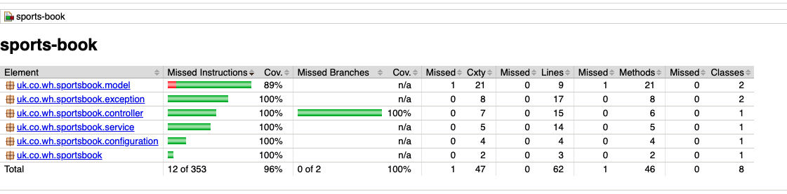

# sports-book

This microservice is able to create, find and update scoreboards and store them through a persistence layer.
Additionally, the service pushes the scores updates to RabbitMQ message broker which feeds the webhook for client’s browser.

This microservice is using Spring Boot, H2 in-memory database and RabbitMQ libraries.

## Prerequisites
- Java
- [Spring Boot](https://spring.io/projects/spring-boot)
- [Maven](https://maven.apache.org/guides/index.html)
- [H2 Database](https://www.h2database.com/html/main.html)
- [Lombok](https://objectcomputing.com/resources/publications/sett/january-2010-reducing-boilerplate-code-with-project-lombok)


## Tools
- Eclipse or IntelliJ IDEA (or any preferred IDE) with embedded Maven
- Maven
- Postman (or any RESTful API testing tool)
#   


##  Build and Run application
_GOTO >_ **~/absolute-path-to-directory/sports-book**  
and try below command in terminal
> **```mvn spring-boot:run```** it will run application as spring boot application

or
> **```mvn clean install```** it will build application and create **jar** file under target directory

Run jar file from below path with given command
> **```java -jar ~/path-to-sports-book/target/sports-book-1.0.0-RELEASE.jar```**

Or
> run main method from `SportsBookApplication.java` as spring boot application.


## Rabbit MQ Setup

> Please follow the below instruction to setup Docker.

Create docker-compose.yml file with screenshot content to spin up aaRabbitMQ instance with Docker containers

Let’s now test the compose file by running the command docker-compose up -d. Running docker-compose up will download and set up the Rabbit MQ container.

More details: https://www.section.io/engineering-education/dockerize-a-rabbitmq-instance/


Once Docker is started, access the management console and create the following. 

queue: browserWebHookQueue

exchange: browserWebHookExchange

routingkey: browserWebHookRouteKey


## Logging

**@Lombok** - Lombok is used for logging <br/>
#   

## API Endpoints

- #### SportsBook Microservice Endpoint
  > **Post Mapping** http://localhost:8080/sportbook/create - Create New Football Match
  Request Body
     ```
        {
           "teamA": "ManU",	
           "teamB": "Chelsea",	
           "scoreTeamA": 0,	
	       "scoreTeamB": 1
        }
     ```
  > **Post Mapping** http://localhost:8080/sportbook/update - Update an ongoing Football Match
  Request Body
     ```
        {
           "id": "1",
           "teamA": "ManU",	
           "teamB": "Chelsea",	
           "scoreTeamA": 0,	
	       "scoreTeamB": 1
        }
     ```
  > **Get Mapping** http://localhost:8080/sportbook/id/{id}  - Find score of a Football Match by id

     ```
        id= Match id
     ```
## Swagger Endpoints
> **Swagger URL:** http://localhost:8080/swagger-ui/index.html#

> **api-docs:** http://localhost:8080/v3/api-docs/

## H2 Database Endpoint
> **H2 Datbase URL:** http://localhost:8080/h2-console/login.jsp

## Code Coverage


